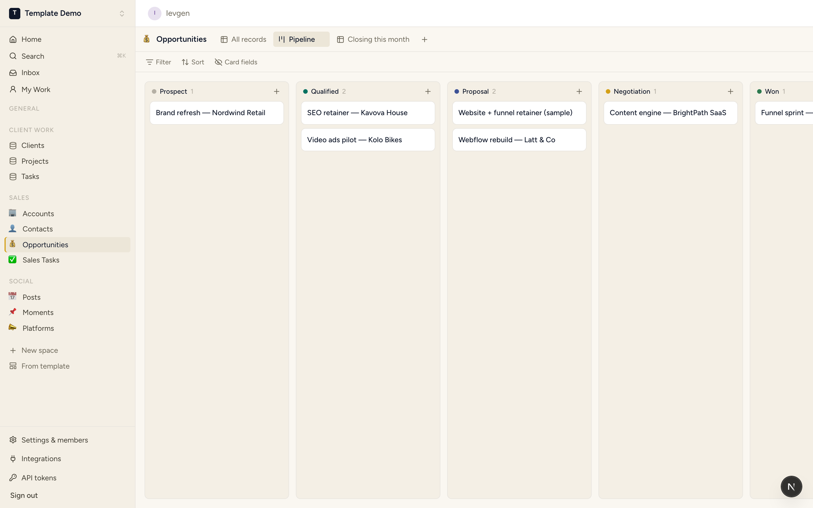
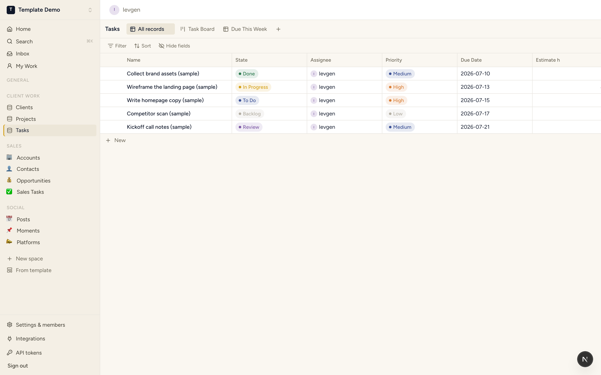
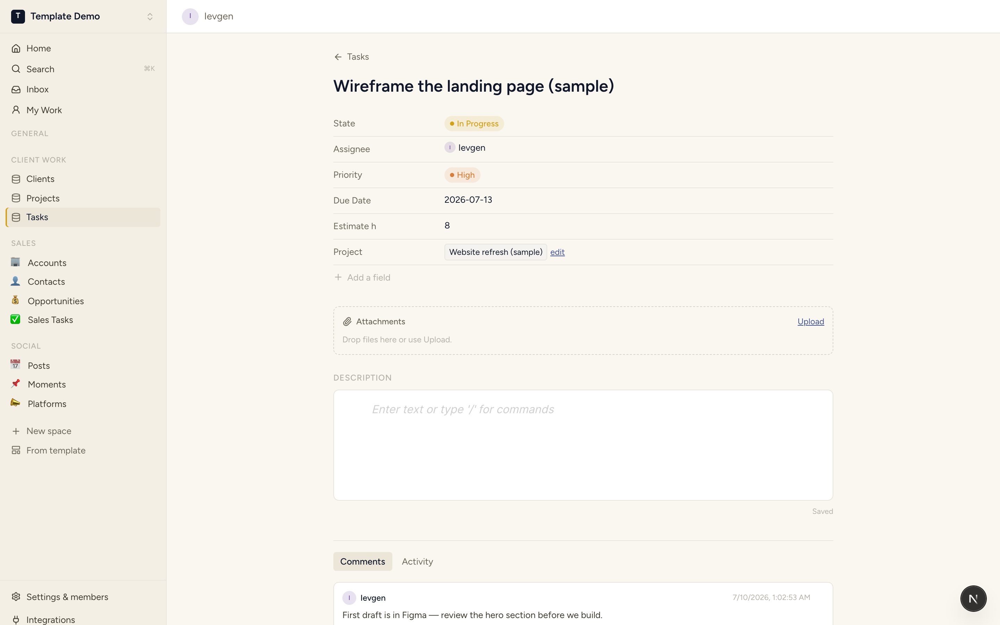
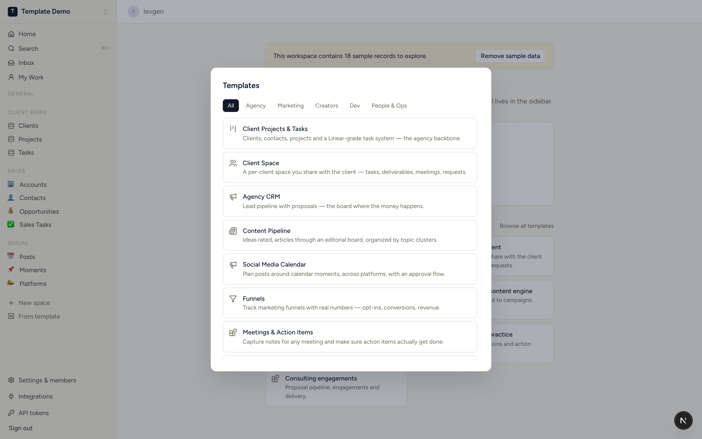
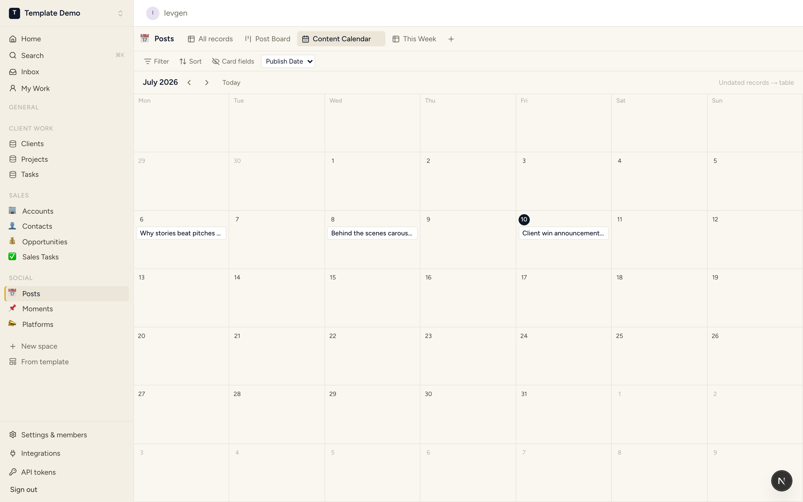
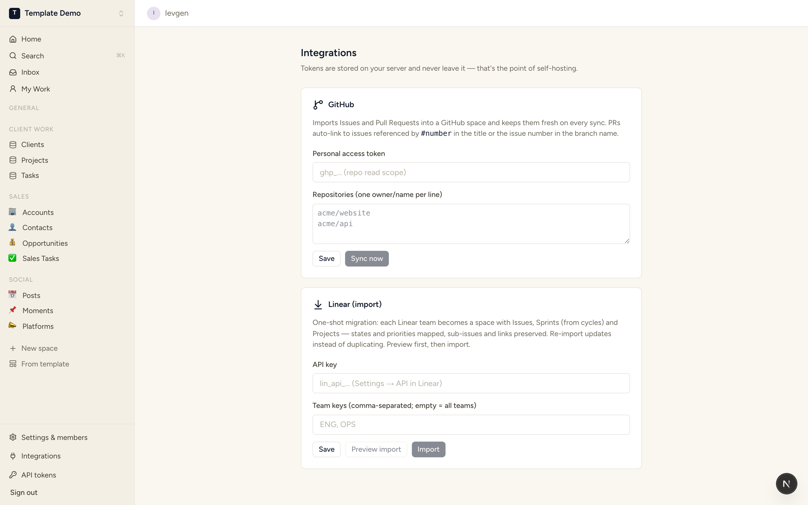

<p align="center">
  <picture>
    <source media="(prefers-color-scheme: dark)" srcset="apps/web/public/brand/logo-dark.svg" />
    
  </picture>
</p>

<p align="center">
  <strong>The open-source work OS: user-defined relational databases that can run an entire company.</strong><br/>
  Clients, tasks, content pipelines, CRM, sprints — one engine, your schema, your server.
</p>

<p align="center">
  <a href="LICENSE"></a>
  
  
</p>

---

StoryOS is a connected-database work OS, open source and API-first. You define databases, connect them with real relations, and look at the same records through tables, kanban boards, calendars, galleries, lists, feeds, and timelines. Nothing is paywalled. The web UI is just the first client of a public REST API — everything it does, a script (or an AI agent, via MCP) can do.



## Features

**The engine**
- **Databases & fields** — text, rich text, number, checkbox, date, select, multi-select, URL, email, person, relation, lookup, rollup, formula, button. Schema changes are runtime API calls, not migrations.
- **Relations** — first-class, paired on both sides (a Project sees its Tasks, a Task sees its Project), one-to-many or many-to-many, across spaces.
- **Lookups & rollups** — surface a related record's field, or aggregate related records (count / sum / avg / min / max).
- **Formulas** — `{Allocation} - {Days Used}`, `days_between(today(), {Due})`, 19 functions, 5-level chains. [Docs →](docs/product/formulas.md)
- **Views** — table (virtualized, inline editing, multi-select batch edits), kanban with drag-and-drop, and calendar with drag-to-reschedule. Saved filters and sorts per view.
- **Entity pages** — every record is a page: fields, rich-text description, attachments, comments with @mentions, and a full activity trail.




**Working in it**
- **Templates** — 19 installable packs (client work, sales CRM, content pipeline, social calendar, meetings, org chart, time off, dev project…), each with sample data and a built-in guide. [Library →](docs/product/template-library.md)
- **Automations & buttons** — trigger on record changes or a schedule; buttons run actions with one click. [Docs →](docs/product/automations.md)
- **Cmd+K** — palette with search, navigation, and recents. Inbox and My Work views for notifications and assignments.
- **Guests & granular access** — invite a client into exactly one space with viewer → commenter → editor → creator grants. Everything else is invisible to them.
- **CSV import** — with type inference, relation matching by title, and a dry run. [Migrate your data →](docs/product/migrate-data.md)




**Integrations**
- **GitHub** — import & refresh Issues and PRs; PRs auto-link to issues referenced by `#N` in the title or the issue number in the branch name. Your token stays on your server.
- **Linear** — one-shot migration: each team becomes a space with Issues, Sprints, and Projects; states, priorities, sub-issues, and links preserved; idempotent re-import. [Mapping table →](docs/product/migrate-from-linear.md)



**API-first**
- Versioned REST API under `/api/v1`, OpenAPI 3.1 spec generated from code, interactive docs at `/api/docs` on your instance.
- Personal access tokens, rate limiting, a query endpoint with a filter AST — everything needed to build an MCP server or any other client. [Guides →](docs/api/)

## Install (self-hosted)

One Postgres, two containers, one command:

```bash
git clone https://github.com/StoryFunnels/storyOS.git storyos && cd storyos
echo "BETTER_AUTH_SECRET=$(openssl rand -hex 32)" > .env
docker compose up -d
```

Open **http://localhost** and sign up — the first account creates its own workspace, migrations run automatically. 1 GB RAM is plenty for a small team.

The full guide — environment matrix, SMTP, Google OAuth, S3/MinIO attachments, backups, upgrades — is in **[docs/self-hosting.md](docs/self-hosting.md)**.

## Develop

```bash
pnpm install
docker compose -f docker-compose.dev.yml up -d   # Postgres + Mailpit (dev infra only)
cp apps/api/.env.example apps/api/.env
pnpm dev                                          # api on :3001, web on :3000
```

`pnpm test` runs the API integration suite (Testcontainers), `pnpm lint` / `pnpm typecheck` are the gates, `pnpm sdk:generate` regenerates the typed SDK from the OpenAPI spec.

## Principles

1. **Relations are the core primitive.** A database without relations is a spreadsheet.
2. **API-first, no exceptions.** The UI consumes the same public API everyone else gets.
3. **Capability is never paywalled.** The self-hosted core is fully capable, free forever. Future monetization is managed hosting and AI on top — never crippling the engine.
4. **Structure over documents.** The unit of work is a record in a database, not a page in a tree.
5. **Schema is data.** Databases, fields, relations, and views are API resources with stable IDs.
6. **Boring, predictable, self-hostable.** Runs a 10-person agency on a $10 VPS.

## Repo map

| Path | What's there |
|---|---|
| [apps/api](apps/api/) | NestJS (Fastify) REST API — the product's brain |
| [apps/web](apps/web/) | Next.js web app — client #1 of the API |
| [packages/schemas](packages/schemas/) | Shared zod schemas + the formula engine |
| [packages/sdk](packages/sdk/) | Typed client generated from the OpenAPI spec |
| [packages/mcp](packages/mcp/) | **MCP server** — use StoryOS from Claude / any MCP client ([setup](packages/mcp/README.md)) |
| [docs/self-hosting.md](docs/self-hosting.md) | Install, configure, backup, upgrade |
| [docs/product/](docs/product/) | Vision, formulas, automations, templates, migration guides |
| [docs/architecture/](docs/architecture/) | Meta-model, record storage, API conventions, auth |
| [docs/decisions/](docs/decisions/) | ADRs — the decisions we don't relitigate |
| [docs/api/](docs/api/) | API guides: auth, querying, build an MCP server |
| [tickets/](tickets/) | The full development backlog, MN-001 onwards — how this was built |

## Stack

TypeScript monorepo (pnpm + Turborepo) · NestJS 11 on Fastify · Next.js 16 · PostgreSQL 16 (the only datastore) · Drizzle ORM · better-auth · BlockNote · zod · OpenAPI 3.1 generated from code. Rationale in [ADR-0001](docs/decisions/ADR-0001-stack.md).

## License

**Dual-licensed.** [AGPL-3.0-or-later](LICENSE) for everyone — free forever; if you host it as a service, share your changes back. A separate **commercial license** is available for organizations that cannot accept the AGPL — same code, different legal terms. See [docs/licensing.md](docs/licensing.md).

Contributions require agreeing to the [Contributor License Agreement](CLA.md) — see [CONTRIBUTING.md](CONTRIBUTING.md).
